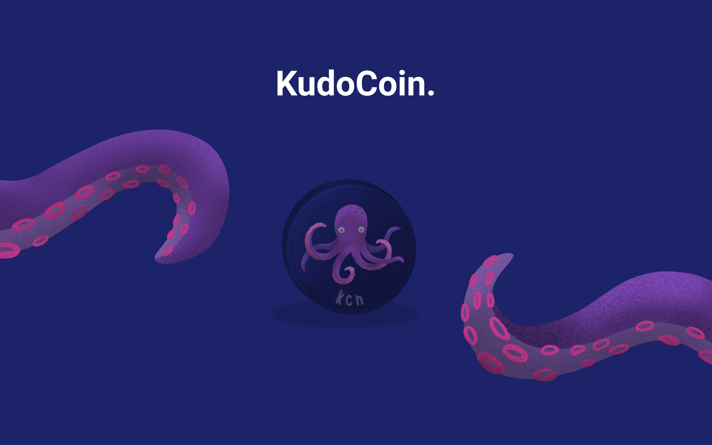
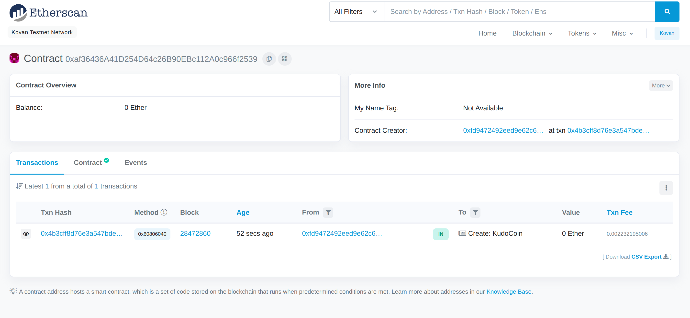

# KudoCoin - BackToHacking 2021

## BackToHacking Winner!! (Best Incomplete Hack)
https://devpost.com/software/kudocoin

## Contract Address:
0xaf36436A41D254D64c26B90EBc112A0c966f2539

## Inspiration
Our ideation for this project jumped right into the realm of cryptocurrency. Initially a team of 4, we ended up creating this as 2 developers finalizing our idea after the Friday workday. Throughout our day, colleagues helped each other, stack overflow posts and GitHub issues were read, all of which helped us accomplish various day-to-day tasks. We decided there was an opportunity to combine the two areas and create something positive. That's where we decided to elevate the idea of giving a Kudo to someone who lent a hand, by backing it with a digital asset.

## What it does
KudoCoin is an ERC20 token that serves its purpose as street cred for developers. When a user first links their Github handle to a wallet address, they have 0 KudoCoins (KCN). Every time they help a fellow colleague in real life, or a random stranger on the internet, the individual being helped may decide to award this user with a KCN. A coin is subtracted from the helped account to the account of the helper. In addition, a new coin is generated into the source faucet account. The purpose of this is so that token supply can steadily increase as more and more developers appear, while also allowing for deflation management through our burn functions. Tokens can then leave the source faucet account in two ways, the first being annual deposits to accredited universities and educational institutes to pass onto their students, and the second being companies making impactful contributions or donations to various tech causes (Women in Tech, BootCamps in Third World Countries). They can then redistribute the KCN back into the community via their employees. The benefit of this is that statistically bad hire rates for certain tech roles are as high as 50% for some companies. With KCN, recruiters can view a candidate's balance and have an accurate gauge of how impactful they are in the development community. No need for algorithm questions!

## How we built it
We started off our project by designing the core KudoCoin, an ERC20 compliant, mintable, and burnable token on the ethereum blockchain. We added the basic constructor, transfer functions and the additional approve, burn, and mint functions. The extended functions allow the deployer of the token to destroy tokens for deflation, or create new tokens for adapting to the growth of the ecosystem. Once that was done, we started to build a front-end interface on kudocoin.tech for users to link their Github, as well as for companies to view user profiles. This was while we built a backend to support these features, and manage some of the blockchain transactions. 

## Challenges we ran into
The biggest challenge we ran into was unfamiliarity with cryptocurrency. This was our first time building our own token, and a lot of the basics of blockchain weren't familiar with us coming in, so it was a steep learning curve. Usually, it's challenging to build a frontend backend application with a 4 person team at a hackathon, but we had to adapt with a 2 person team while adding an extra token layer. In addition, due to the early start time of the competition, we didn't plan well ahead of time and started with a delayed schedule, leaving a lot of challenging work to the end.

## Accomplishments that we're proud of
We are very proud that we were able to get a deployed token up. Being able to have transferred some KCN from my test wallet on MetaMask to another wallet felt really great. Building our own token was something we wouldn't have really done on our own, but it was a perfect scenario to build it for this hackathon. Our contract address: 0xaf36436A41D254D64c26B90EBc112A0c966f2539

## What we learned
We learned so much about cryptocurrency, the ethereum blockchain, smart contracts, and the ERC20 protocol. When the token was made, it felt so satisfying to discover a whole world of development that was out there, all of which have popped up recently. The greatest thing we learned, is that there's so much more to learn about cryptocurrency and we have only scratched the service. The media and financial sector coverage don't do justice to what's out there.

## What's next for KudoCoin
KudoCoin is currently deployed on the Kovan test net. We would love to take this into the real world and deploy it onto the Ethereum main net. Before we are ready for this, our front end needs to be polished up from a UI/UX perspective, to be even more user-friendly and create a profile that companies go to before they even view a resume. We strongly believe the open-source development community would love the opportunity to give their thanks to those who help, so we want to provide the best supporting platform as adoption increases for the coin.
